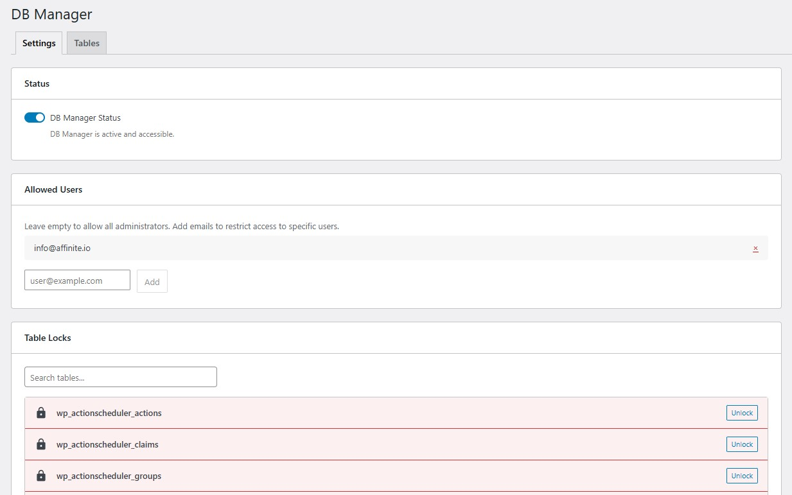
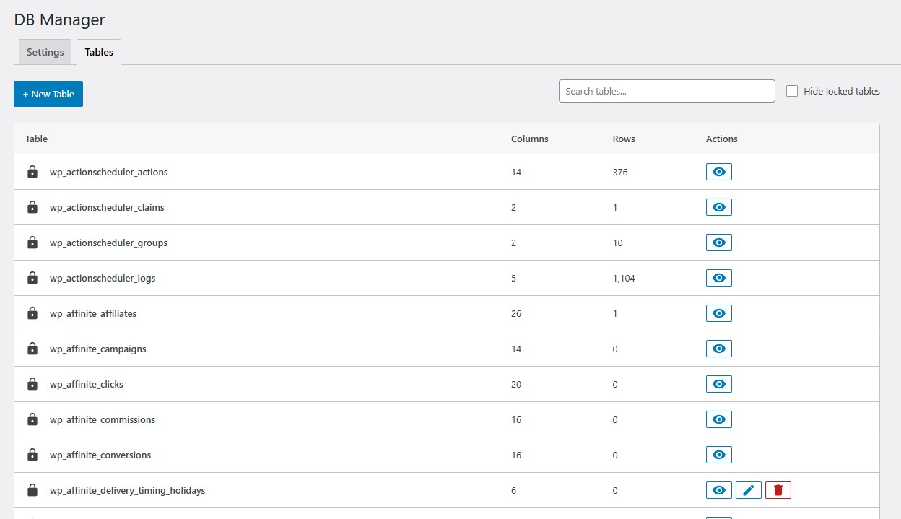
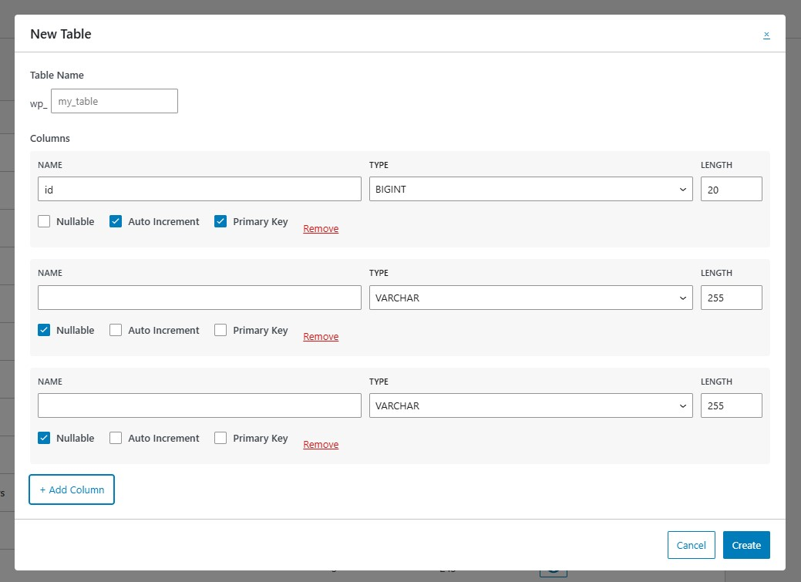

# Affinite DB Manager

Complex database adminer for WordPress with advanced table, column, index, and relation management.

## Description

Affinite DB Manager is a comprehensive database administration tool for WordPress that allows administrators to manage database tables, columns, indexes, and foreign key relations directly from the WordPress admin interface.

## Features

* View and manage all database tables
* Create, modify, and delete tables
* Manage table columns with full type support
* Create and manage indexes (INDEX, UNIQUE, FULLTEXT, SPATIAL)
* Manage foreign key relations
* Preview table data
* Table locking system for protection
* Email-based access control
* Modern React-based interface

## Installation

1. Upload the plugin files to the `/wp-content/plugins/affinite-db-manager` directory, or install the plugin through the WordPress plugins screen directly.
2. Activate the plugin through the 'Plugins' screen in WordPress.
3. Navigate to Tools > DB Manager to configure settings.

## Development

### Prerequisites

- Node.js and npm
- PHP 8.1+
- Composer

### Building Assets

1. Clone the repository:
   ```bash
   git clone https://github.com/Affinite/affinite-db-manager.git
   cd affinite-db-manager
   ```

2. Install dependencies:
   ```bash
   npm install
   ```

3. Build assets:
   ```bash
   npm run build
   ```

4. The compiled files will be output to `build/js/`

### Source Files Structure

- **JavaScript/React source:** `assets/src/js/`
- **CSS source:** `assets/src/css/` (or `assets/src/scss/`)
- **Compiled output:** `build/js/`
- **PHP source:** `src/`

### PHP Development

1. Install PHP dependencies:
   ```bash
   composer install
   ```

2. The plugin follows PSR-4 autoloading standards.

## Security

The plugin includes multiple security layers:
- Capability checks
- Table locking system
- Email-based access control
- SQL injection protection using `wpdb::prepare()`

## Requirements

- WordPress 6.3 or higher
- PHP 8.1 or higher

## License

GPL-2.0-or-later

## Support

For issues, feature requests, or contributions, please visit the [GitHub repository](https://github.com/Affinite/affinite-db-manager).

## Screenshots

### Admin dashboard


### Table editor


### Column editor


## Changelog

### 1.0.1
* Fix missing vendor folder

### 1.0.0
* Initial release
